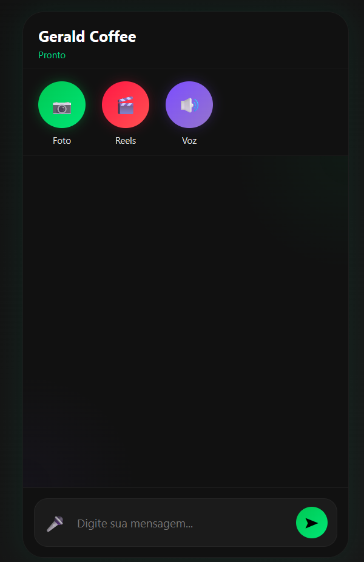

# ☕ Gerald Coffee - O Chat Ranzinza




**Gerald Coffee** não é apenas mais um chatbot. Ele é um assistente impaciente, sarcástico, inteligente e corinthiano roxo. Se você procura respostas diretas, sem "frufru" e com um toque de mau humor clássico, você veio ao lugar certo.

---

## 🚀 Tecnologias Utilizadas

Este projeto integra o que há de mais moderno em IA generativa e síntese de voz:

* **Cérebro (LLM):** [Hugging Face](https://huggingface.co/) utilizando o modelo `Meta-Llama-3-8B-Instruct`.
* **Voz (TTS):** [Microsoft Azure Cognitive Services](https://azure.microsoft.com/services/cognitive-services/speech-services/) com a voz neural `pt-BR-DonatoNeural`.
* **Backend:** Python com Flask.
* **Frontend:** HTML/CSS moderno com interface responsiva e interativa.
* **Deploy:** Hospedado via Render.

---

## 🛠️ Funcionalidades

- [x] **Conversação Inteligente:** Respostas rápidas e contextuais com a API de inferência do Hugging Face.
- [x] **Personalidade Única:** Configurado via *System Prompt* para manter o estilo sarcástico e corinthiano.
- [x] **Voz Neural:** O bot não apenas escreve, ele "fala" as respostas com um tom de voz maduro e sério.
- [x] **Interface Intuitiva:** Chat limpo com suporte a envio de mensagens e reprodução automática de áudio.
- [x] **Segurança:** Uso de variáveis de ambiente para proteção de chaves de API.

---

## 📋 Como rodar o projeto localmente

1. **Clone o repositório:**
   ```bash
   git clone [https://github.com/geraldocafe1/chat_com_Voz_Microsoft.git](https://github.com/geraldocafe1/chat_com_Voz_Microsoft.git)

3. Criar e Ativar Ambiente Virtual
Bash
python -m venv .venv
# No Windows:
.venv\Scripts\activate
# No Linux/Mac:
source .venv/bin/activate

4. Instalar Dependências
Bash
pip install -r requirements.txt

5. Configurar Variáveis de Ambiente
Crie um arquivo chamado .env na raiz do projeto e adicione suas credenciais:

Snippet de código
HF_TOKEN=seu_token_hugging_face
AZURE_SPEECH_KEY=sua_chave_azure
AZURE_SPEECH_REGION=sua_regiao_azure (ex: eastus)
HF_MODEL=meta-llama/Meta-Llama-3-8B-Instruct

6. Iniciar o Servidor
Bash
python app.py
Acesse em: http://127.0.0.1:5000

🌐 Deploy no Render
Para colocar o Gerald Coffee online:

Conecte este repositório ao Render.com.

Defina o Build Command como: pip install -r requirements.txt.

Defina o Start Command como: gunicorn app:app.

Adicione as chaves do seu .env na aba Environment do painel do Render.